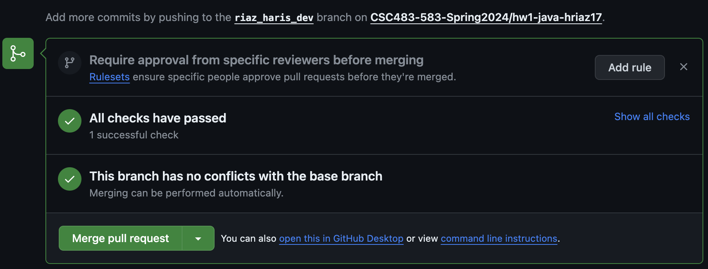
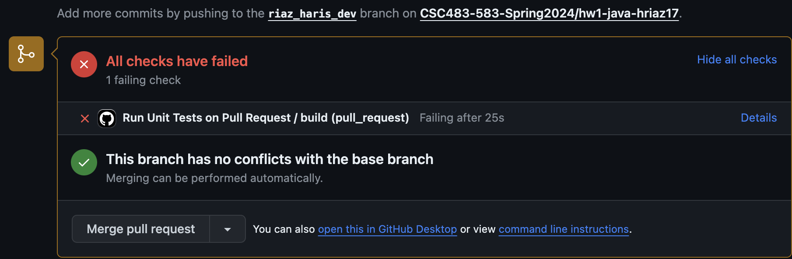

# Setup your environment

You will need to set up an appropriate coding environment on whatever computer
you expect to use for this assignment.
Minimally, you should install:

* [git](https://git-scm.com/downloads)
* [Java](https://www.java.com/en/) (8 or higher)
* [SBT](https://www.scala-sbt.org/download.html)

# Check out a new branch

Before you start editing any code, you will need to create a new branch in your
GitHub repository to hold your work.

1. Go to the repository that GitHub Classroom created for you. You should have received an email/link and you are most probably reading this there. It should look like
`https://github.com/CSC483-583-Spring-2024/hw2-scala-<your-username>`, where
`<your-username>` is your GitHub username. 
[Create a branch through the GitHub interface](https://help.github.com/articles/creating-and-deleting-branches-within-your-repository/).
2. Name your `<branch>` as `lastname_firstname_dev`
2. Clone the repository to your local machine and checkout the branch you
just created. Your command must be similar to :
   ```
   git clone -b <branch> https://github.com/CSC483-583-Spring-2024/hw2-scala-<your-username>.git
   git checkout lastname_firstname_dev
   ```

# Write your code

You will implement one function for each of the sub questions of question 8, Eg:`runQ8_1_1()` inside the class `InvertedIndex`. These functions should return the documents as asked in the question, as a String array. 

Also, you **should not edit** these files:
- `src/main/resources/Docs.txt`
- `src/test/scala/csc583/TestQ8.scala`

**Note: The file `src/main/resources/Docs.txt` is the input file you must use (or would have started using) as per assignment guidelines. Please don't edit it.**


# Test your code

Tests have been provided for you in the `src/test/scala/csc583/TestQ8.scala` file.
To run all the provided tests, run the ``sbt test`` script from the top project directory which contains a file named `build.sbt`.

For more information on sbt, see: https://www.scala-sbt.org/1.x/docs/Getting-Started.html

# Submit your code

As you are working on the code, you should regularly `git commit` to save your
current changes locally and `git push` to push all saved changes to the remote
repository on GitHub.

To submit your assignment,
[create a pull request on GitHub](https://help.github.com/articles/creating-a-pull-request/#creating-the-pull-request).
where the "base" branch is "master", and the "compare" branch is the branch you
created at the beginning of this assignment.
Then go to the "Files changed" tab, and make sure that all your changes look as you would expect them
to.
There are test cases that will be run automatically
when a pull request is submitted. 
These are the same as `sbt test`. 
So if your code passed `sbt test` in your machine, 
it’s highly likely that it will pass in GitHub. Nevertheless, 
you should make sure that you see a green tick mark or a message 
saying “All Checks Have Passed” like this:


If your test cases are failing, you will get an error message like this:


click on the link which says `details` and find out what is causing the issue or which test case is not passing. Once you have identified that, close the pull request, fix the errors, and raise another pull request.
**Do not merge the pull request.**

Your instructor will grade the code off this pull request. Pull requests submitted after the deadline won’t be considered. You must also submit the answers to the other written questions on Gradescope.

# Grading

Question 8 of this assignment will be graded primarily on their ability to pass the tests that have been provided to you on GitHub after the pull request.
Assignments that pass all, and with the corresponding code implementing the correct logic, will receive at least 95% of the possible points.

To get the remaining of the points, your code will be checked for things like readability and code quality.
